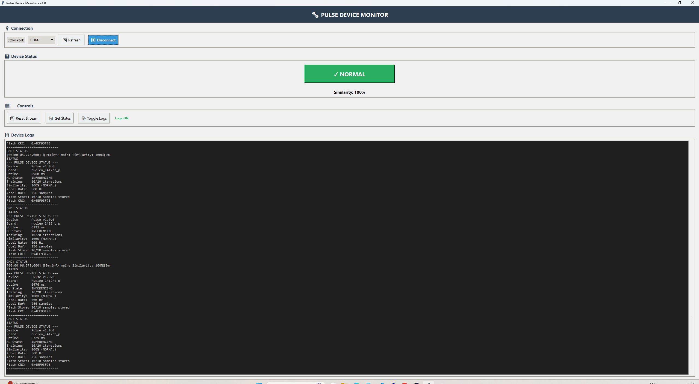
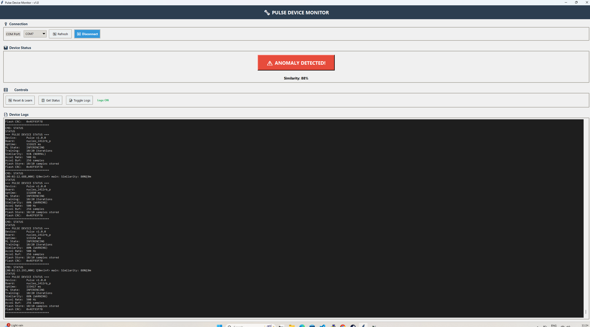
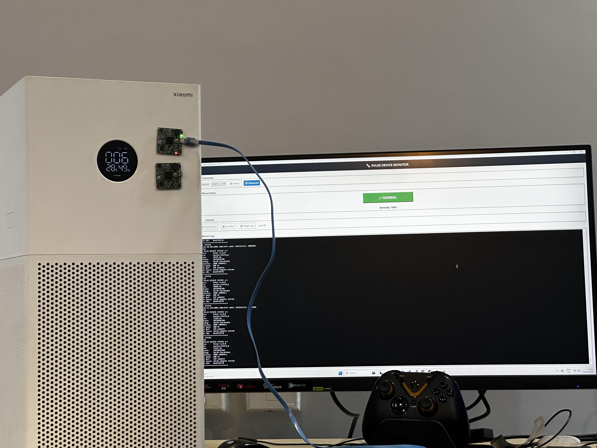

# Pulse ⚡

> Real-time vibration anomaly detection on a microcontroller — no cloud, no subscription, no IT team required.

[](https://www.zephyrproject.org/)
[](https://www.st.com/en/microcontrollers-microprocessors/stm32l4-series.html)
[](https://www.st.com/en/development-tools/nanoedgeaistudio.html)
[](LICENSE)

---

## The Problem

Motors, fans, pumps, and compressors fail. They always give warnings — subtle changes in vibration — but nobody catches them until it's too late and the machine has already broken down.

Enterprise predictive maintenance systems exist, but they cost tens of thousands of dollars, require stable internet connectivity, and need a dedicated IT team to run. Small factories, workshops, and facilities simply go without.

**Pulse is a $15 device that changes that.**

---

## What Pulse Does

Pulse is a palm-sized embedded device that:

1. **Learns** what your machine's normal vibration feels like (takes ~30 seconds)
2. **Monitors** continuously in real-time using on-device machine learning
3. **Alerts** the moment vibration patterns deviate from normal

No internet. No cloud. No subscription. Everything runs on a 40KB RAM microcontroller.

Mount it on any vibrating surface. Press reset to train. Walk away. Pulse watches so you don't have to.

---

## Demo

> 📹 **Video coming soon** — Currently testing on an air purifier fan. Anomaly triggered by tapping the unit during inference is detected within one inference cycle (~600ms).

**GUI Monitor:**







The Python-based GUI shows live similarity scores, color-coded status (green = normal, red = anomaly), and a real-time log — all over USB without any additional hardware.

---

## Real World Applications

Pulse can monitor anything that vibrates:

| Application | What to Detect |
|---|---|
| Electric motors | Bearing wear, shaft imbalance, winding faults |
| Industrial fans / air purifiers | Blade damage, obstruction, motor degradation |
| Pumps | Cavitation, misalignment, impeller damage |
| CNC spindles | Tool wear, chatter, abnormal cutting forces |
| Washing machines | Unbalanced loads, drum bearing failure |
| HVAC compressors | Refrigerant issues, mechanical wear |
| PC cooling systems | Fan bearing failure, dust buildup |

If it vibrates and has a surface you can attach a sensor to, Pulse can learn it and watch it.

---

## How It Works

Pulse uses **STMicroelectronics NanoEdge AI** — a library that runs a trained anomaly detection model entirely on the STM32L412RB microcontroller. There is no external processor, no cloud inference, and no network dependency.

### Boot Flow

One of Pulse's most important features is **persistent training data**. Training samples are saved to onboard flash (NVS) as they are collected, and reloaded automatically on every boot. This means once Pulse has learned your machine, it remembers — even after a power cycle.

```
Power On
   ↓
Initialize NVS flash storage
   ↓
Check flash for previously saved training samples
   ├── Samples found (with valid CRC32)?
   │      ↓
   │   Reconstruct ML model from stored samples
   │      ↓
   │   Enough iterations? → Jump straight to INFERENCING
   │   Not enough?        → Resume TRAINING from where it left off
   │
   └── No samples found (first boot or after RESET)
          ↓
       Start fresh TRAINING
   ↓
Initialize NanoEdge AI engine
   ↓
Start LIS2DH12 accelerometer @ 500 Hz
   ↓
TRAINING: Collect samples of normal vibration
   │   Each sample saved to flash immediately (up to 10 stored)
   │   Automatic transition when model is satisfied
   ↓
INFERENCING: Compare live vibration to learned baseline
   ↓
Output similarity score every ~600ms
   ↓
Alert if similarity drops below threshold
```

### Flash Storage Design

Training samples are stored using Zephyr's **NVS (Non-Volatile Storage)** filesystem directly in internal flash. Key design decisions from the code:

- Up to **10 training samples** persisted (each 768 floats = ~3KB)
- Each sample split into **2 chunks** to fit NVS write limits
- Header protected by **CRC32** (covers magic number, version, and sample count)
- On boot, header is validated before any samples are loaded — corrupted or incompatible data is safely discarded
- **RESET command** clears both RAM state and the flash header atomically

This means Pulse survives power loss during training and picks up where it left off.

### Similarity Score

| Score | Meaning |
|---|---|
| **≥ 90%** | Normal — vibration matches learned baseline |
| **70–89%** | Warning — noticeable deviation, watch closely |
| **< 70%** | Anomaly — significant change detected |

---

## Key Technical Features

- **On-device Learning**: Train directly on the hardware — no PC, no data upload, no model training pipeline
- **Persistent Training Memory**: Training samples saved to internal flash via Zephyr NVS — Pulse remembers what it learned across power cycles, with CRC32-validated header for data integrity
- **Smart Boot Recovery**: On startup, Pulse reloads stored samples and reconstructs the ML model automatically — if enough data exists, it skips straight to inferencing without retraining
- **Real-time Inference**: Full inference cycle under 600ms end-to-end
- **3-axis Accelerometer**: Captures vibration in X, Y, Z simultaneously at 500 Hz
- **Three-level Alerting**: Normal (≥90%), Warning (70–89%), and Anomaly (<70%) thresholds for nuanced monitoring
- **Thread-safe Design**: Double buffering with mutex-protected critical sections between sensor thread and ML thread
- **Zephyr RTOS**: Production-grade multithreading, deterministic scheduling, fault isolation
- **USB CDC Shell**: Interact with the device over USB — no additional programmer or debugger needed after initial flash
- **Python GUI Monitor**: Real-time visualization of similarity scores and device state
- **Minimal BOM**: STM32L412RB Nucleo + LIS2DH12 accelerometer module — under $15 total

---

## Hardware

### Required Components

| Component | Details | Approx Cost |
|---|---|---|
| STM32L412RB Nucleo | ARM Cortex-M4F @ 80MHz, 128KB Flash, 40KB SRAM | ~$12 |
| LIS2DH12 breakout | 3-axis MEMS accelerometer, I2C | ~$2 |
| USB cable | For power, flashing, and serial communication | — |

**Total BOM: ~$14**

### Wiring

```
STM32L412RB Nucleo       LIS2DH12
──────────────────       ────────
PC0 (I2C3_SCL)    ──→   SCL
PC1 (I2C3_SDA)    ──→   SDA
3.3V              ──→   VDD
GND               ──→   GND
```

### Architecture

```
┌─────────────────────────────────────────────────────┐
│                   Main Thread                        │
│  ┌──────────────┐      ┌──────────────────────┐    │
│  │ State Machine│◄────►│ NanoEdge AI Library  │    │
│  └──────────────┘      └──────────────────────┘    │
│         ▲                                            │
│         │ Events (EVT_DATA_READY)                    │
└─────────┼────────────────────────────────────────────┘
          │ Callback
┌─────────┼────────────────────────────────────────────┐
│         ▼                                            │
│  ┌──────────────┐      ┌──────────────────────┐    │
│  │ Accel Thread │◄────►│ LIS2DH12 @ 500Hz     │    │
│  │ Double Buffer│      │ (I2C3)               │    │
│  └──────────────┘      └──────────────────────┘    │
└──────────────────────────────────────────────────────┘
          │ USB CDC
┌─────────┼────────────────────────────────────────────┐
│         ▼                                            │
│   Python GUI Monitor / Serial Terminal               │
└──────────────────────────────────────────────────────┘
```

### Memory Footprint

```
| Resource | Usage | Total | Percentage |
|----------|-------|-------|------------|
| Flash    | ~70 KB | 128 KB | ~55% |
| SRAM     | ~25 KB | 40 KB | ~62% |
| CPU (avg)| ~30% | 80 MHz | - |
```

### Performance

| Metric | Value |
|---|---|
| Sample rate | 500 Hz (3-axis) |
| Samples per inference window | 256 per axis (768 total) |
| Sample collection time | 512 ms |
| ML inference time | 10–50 ms |
| End-to-end latency | < 600 ms |
| Training time | ~30 seconds (20 iterations) |
| Flash usage | ~55% (70KB / 128KB) |
| RAM usage | ~62% (25KB / 40KB) |

---

## Software Setup

### Prerequisites

- [Zephyr SDK](https://docs.zephyrproject.org/latest/develop/getting_started/index.html) v3.x
- CMake >= 3.20
- West (Zephyr meta-tool)
- Python 3.x (for GUI monitor)
- NanoEdge AI Studio account (free, from ST)

### 1. Clone

```bash
git clone https://github.com/Ayushkothari96/pulse.git
cd pulse
```

### 2. Get NanoEdge AI Library

Pulse uses ST's NanoEdge AI for on-device ML. You need to generate a library for your specific use case:

1. Visit [NanoEdge AI Studio](https://www.st.com/en/development-tools/nanoedgeaistudio.html) (free ST account required)
2. Create a new **Anomaly Detection** project with:
   - Sensor: 3-axis accelerometer
   - Sampling rate: 500 Hz
   - Signal length: 256 samples per axis
   - Target: STM32 ARM Cortex-M4F
3. Benchmark and export the library
4. Place `libneai.a` and `NanoEdgeAI.h` in `lib/nanoedge_ai/`
5. Update `KNOWLEDGE_BUFFER_SIZE` in `src/main.c` to match your export

### 3. Build

```bash
# Windows
start_zephyr_env.bat
west build -b nucleo_l412rb_p

# Linux / macOS
west build -b nucleo_l412rb_p
```

### 4. Flash

```bash
west flash
```

### 5. Run the GUI Monitor

```bash
cd scripts
pip install -r requirements.txt
python pulse_monitor.py
```

Or on Windows, double-click `run_pulse_monitor.bat`.

---

## Using Pulse

### Three Operating States

**IDLE** — Startup or error state. No ML processing.

**TRAINING** — Pulse is learning your machine's normal vibration. Place the device on the machine, let it run normally, and wait ~30 seconds. Feed only normal operation data during this phase. Pulse transitions automatically to INFERENCING when complete.

**INFERENCING** — Pulse is actively monitoring. Similarity scores update every ~600ms. A score below 80% indicates an anomaly.

### USB Console Commands

Connect via any serial terminal (PuTTY, Tera Term, screen) or use the GUI:

```
STATUS   Show current ML state, similarity score, and system info
RESET    Wipe learned model and restart training from scratch
LOGS     Toggle verbose logging (useful for reducing serial traffic)
```

### Mounting Tips

- Mount the device **directly on the vibrating surface** — not nearby, directly on it
- Use double-sided tape or a rubber band for temporary mounting
- Keep the device **still during training** — any handling will pollute the baseline
- For best results, mount in the same orientation each time

---

## Project Status & Honest Limitations

This is a weekend project built by a single embedded engineer. Here is where things actually stand:

- ✅ Firmware stable and working on NUCLEO-L412RB-P
- ✅ Anomaly detection validated on air purifier fan (normal operation vs physical disturbance)
- ✅ GUI monitor working on Windows
- ✅ On-device learning working reliably
- ⚠️ Not yet tested on heavy industrial machinery (motors, pumps, CNC)
- ⚠️ NanoEdge AI library requires a free ST account to generate
- ⚠️ Linux/macOS build path not fully tested
- ⚠️ Anomaly threshold (80%) is a starting point — real-world tuning may be needed per machine
- 🔜 Hardware enclosure / 3D printable case (planned)
- 🔜 Standalone battery-powered operation (planned)
- 🔜 BLE alert output (planned)

---

## Get Involved

I am an embedded engineer building this on weekends because I think low-cost predictive maintenance is a real unsolved problem — especially for small manufacturers who cannot afford enterprise IoT solutions.

If you:
- Work in manufacturing, maintenance, or industrial IoT and want to test this on real machinery
- Are an embedded engineer with experience in Zephyr, STM32, or TinyML
- Want to port this to a different board or sensor
- Have ideas, feedback, or use cases I haven't thought of

**Open an issue or reach out.** Real-world testing feedback is the most valuable thing this project needs right now.

---

## Project Structure

```
pulse/
├── boards/
│   └── nucleo_l412rb_p.overlay      # Device tree overlay
├── inc/
│   └── accelerometer.h              # Accelerometer driver API
├── lib/
│   └── nanoedge_ai/
│       ├── libneai.a                # NanoEdge AI library (generate via Studio)
│       └── NanoEdgeAI.h             # NanoEdge AI header
├── scripts/
│   ├── pulse_monitor.py             # Python GUI monitor
│   ├── requirements.txt             # Python dependencies
│   └── run_pulse_monitor.bat        # Windows launcher
├── src/
│   ├── main.c                       # ML state machine + application logic
│   └── accelerometer.c              # LIS2DH12 I2C driver
├── CMakeLists.txt
├── prj.conf                         # Zephyr config
├── neai_overlay.ld                  # Custom linker script for NanoEdge AI
└── west.yml
```

---

## Troubleshooting

### MemManage Fault during `neai_anomalydetection_init()`
Knowledge buffer size mismatch. Check `KNOWLEDGE_BUFFER_SIZE` in `src/main.c` — it must match the value in your NanoEdge AI export README exactly.

```c
#define KNOWLEDGE_BUFFER_SIZE 4096  // ← update this from your NanoEdge AI export
static uint8_t knowledge_buffer[KNOWLEDGE_BUFFER_SIZE] __attribute__((aligned(4)));
```

### Accelerometer not found
Check I2C wiring (PC0=SCL, PC1=SDA) and verify the device tree overlay is being loaded. I2C address should be 0x18.

### No USB COM port appearing
Wait 2-3 seconds after power-on. Check `CONFIG_USB_DEVICE_STACK=y` in `prj.conf`. Try a different USB cable — some cables are power-only.

### Stack overflow (`STACK CHECK FAIL`)
Increase stack sizes in `prj.conf`: `CONFIG_MAIN_STACK_SIZE=2048` or higher.

### Linker errors about `knowledge_buffer`
Ensure `neai_overlay.ld` exists and `zephyr_linker_sources()` is correctly called in `CMakeLists.txt`.

---

## Acknowledgments

- [STMicroelectronics](https://www.st.com) for NanoEdge AI Studio and the STM32 ecosystem
- [Zephyr Project](https://www.zephyrproject.org/) for an excellent embedded RTOS
- [ARM](https://www.arm.com) for the Cortex-M4F architecture

---

## License

MIT License — see [LICENSE](LICENSE) for details.

---

## Contact

**Ayush Kothari** — [@Ayushkothari96](https://github.com/Ayushkothari96)

Project: [https://github.com/Ayushkothari96/pulse](https://github.com/Ayushkothari96/pulse)

Linkdin: [https://www.linkedin.com/in/ayushkothari96](https://www.linkedin.com/in/ayushkothari96)

---

*Built on weekends. Tested on an air purifier. Meant for the real world.*
